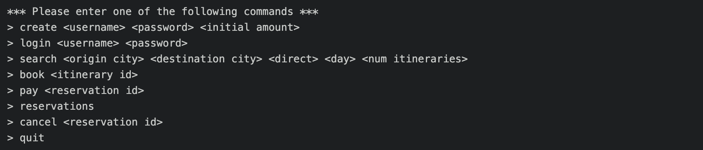
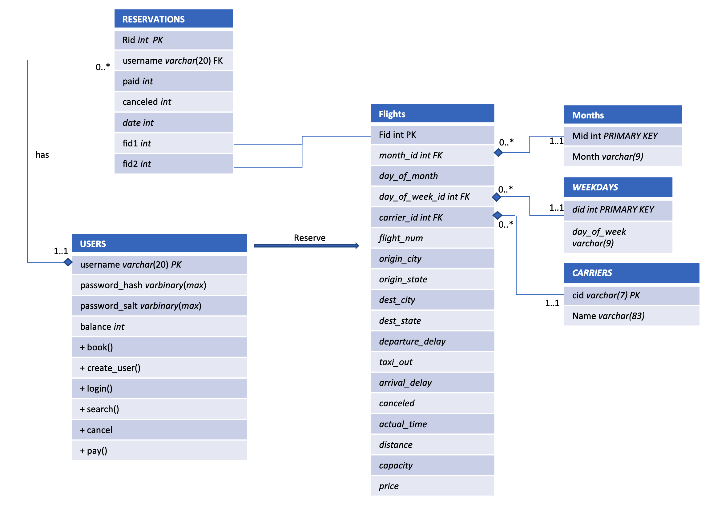

# Flight Reservation App: Database Application and Transaction Management

This is a database application and transaction management app.
**Azure SQL server** from within **Java** via **JDBC**.

**Start the program:** `$ mvn compile exec:java`

## Database Design 
### How did we design the data model for this flight App
At first, we had separate tables for users, reservations, and itineraries, because we thought “data model” 
meant tables. However, upon closer look, we found out that itineraries only exist locally for each user.
Although we can still store those information in a table, it would be much easier to store them locally 
so that we don’t have to deal with read-write conflicts in concurrent sessions. The design of our “Users” 
table is very standard. It stores exactly what is required on the Spec. However, the design of our 
“reservations” table changed a lot throughout the course of the assignment. Originally, we had a secondary 
table called “Reserve Flight” to store the flight IDs corresponding to each Reservation ID. As we later 
found out, having two tables to store reservations means having to update two tables and deal with more 
read-write conflicts in every transaction. So we decided to exclude the secondary table in favor of 
having two flight ID fields in the reservations table. Although some of the itineraries are direct flights, 
we can always store -1 for the non-existent second flight ID.

### UML Diagram (Unified Modeling Language)
